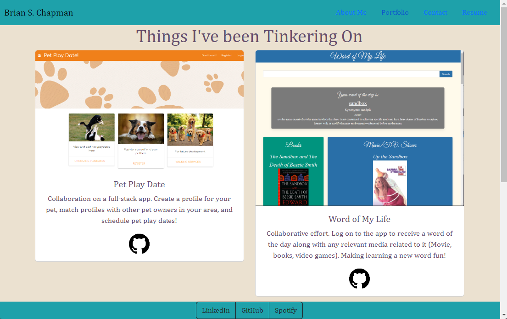

# if-brian-were-a-react-app

## Description

As we edge closer to working on MERN stack applications, it was only a matter of time before we made the jump into React. It's a prominent JavaScript is integral to a lot of UI projects. Taking the knowledge of React that I've acquired over the past few lessons, I've taken my OG static portfolio page and given it the React makeover it deserved. 

## Table of Contents

- [Installation](#installation)
- [Usage](#usage)
- [Credits](#credits)
- [License](#license)

## Installation

There is no installation necessary for this particular project.

## Usage

Here's a quick screenshot of the portfolio page below and a the link to the deployment is right [here](https://brianschapman.github.io/Portfolio-Using-React/) for you. 

    

## License

This project is covered with the MIT license. 
